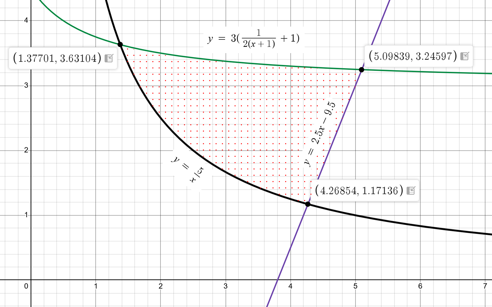

# cmc_second_lab
## Карпов Владимир, 106 гр.
### Задание №6: Вычисление площади фигуры, ограниченной кривыми

**Точность вычислений:** ε = 0.001

**Уравнения кривых:**
1. y = f1(x) = 3*(0.5/(x + 1) + 1)
2. y = f2(x) = 2.5x - 9.5
3. y = f3(x) = 5/x (x > 0)

**Методы:**
- Решение уравнений: Комбинированный метод (хорд и касательных)
- Вычисление интегралов: Формула Симпсона (парабол)

### Требования к программе

1. Основная программа поддерживает опции командной строки:
    Вывод абсцисс точек пересечения кривых.
    Вывод числа итераций, затраченных на решение уравнений.
    Ключ -help для отображения допустимых опций.
2. Реализованы функции root (поиск корня) и integral (вычисление интеграла) на Си и протестированы.
3. Сборка программы осуществляется через Makefile.

